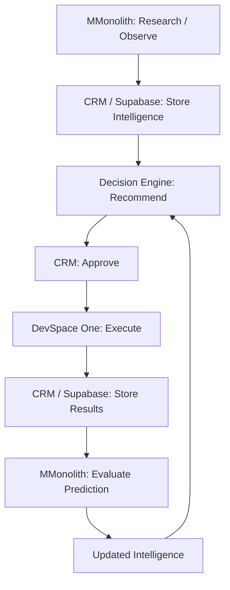

# DevSpace closed-loop intelligence

For the current domain research transfer, package installation and raw evidence
contract, see [domain research](domain-research.md). That guide supersedes the older
normalized-evidence/domain-generation instructions below.

## Ownership and existing components

Four separate applications retain their existing architecture:

- **MMonolith:** external research, market hypotheses, prediction evaluation, updated intelligence. Its independent `services/domain_intelligence` module does not approve or execute anything.
- **CRM/Supabase:** shared tenant state, evidence/history, authenticated admin approval, durable requests and structured results. The existing migrations 014–015, recommendations screen, bot bearer authentication, organization services, constraints and approval/claim/result RPCs remain authoritative.
- **Decision Engine:** deterministic strategy selection under budget, exposure, risk, history and confidence constraints. Its existing domain strategy now evaluates current market reports separately and preserves report evidence links.
- **DevSpace One:** approved execution. `core.feedback_worker` routes `domain_merchant/investigate_domain_category` to the existing Domain Merchant runner. Existing Apollo/outreach and portfolio workflows remain in place. Research libraries and sales import ownership now live in MMonolith; compatibility imports remain in One.



## Data and API contracts

CRM migration **016_feedback_loop.sql** extends `intelligence_reports` with `run_key`, `subject_key`, `previous_report_id`, `correlation_id`, and `is_test`. It reuses `market_signals`, report/signal links, recommendations/evidence, decision runs, requests and results. Added tables:

| Table | Contract |
| --- | --- |
| predictions | Immutable expectation, report, subject, metric, range/value, confidence, measurement window and metric calculation metadata |
| feedback_evaluations | Immutable prediction/result comparison with report, recommendation, request/result lineage, sample size and confidence change |
| intelligence_report_feedback | Same-tenant links from future reports to prior evaluations |

Composite organization foreign keys prevent cross-tenant lineage. Existing RLS conventions allow admins and same-organization users to read. Backend service credentials are trusted across organizations, as in the existing bot APIs; they are not tenant-user credentials. Bot API routes cannot approve recommendations. Review remains an authenticated admin action.

Versioned report rows and predictions cannot be updated or deleted. New reports point to predecessors; old reports remain `CURRENT` as historical snapshots, and the consuming domain strategy selects the newest version per subject and test/live mode. Prediction status remains its immutable creation status; evaluation existence supplies effective evaluated state. Original numbers and windows never change.

All new HTTP routes use the existing CRM `BOT_API_SECRET` bearer authentication and `{success,data}` envelope:

| `/api/bot/feedback-loop/` route | Method and payload |
| --- | --- |
| context | GET `?organization_id=UUID`; paginated internally; intelligence, predictions, evaluation and execution lineage |
| intelligence | POST `{organization_id,bundle:{report,signals,predictions,feedback_ids}}` atomically calls `loop_publish` |
| evaluations | POST `{organization_id,evaluation:{prediction_id,execution_result_id,actual_value,sample_size,evaluation,confidence_after,notes}}` calls `loop_evaluate` |
| claim | POST `{organization_id,service:"domain_merchant"}` rechecks existing approvals and atomically claims a **test investigation only** |
| results | POST `{organization_id,execution_request_id,status,cost,revenue,metrics,results,error?}` reuses `de_record_result` |

Decision Engine's existing `/api/decision-engine/context` additionally returns predictions, feedback evaluations and report/feedback links. Historical reports/results remain available. Scores are 0–100; confidence is 0–1, matching the existing Decision Engine contract. Domain recommendation confidence is capped by its report and any supported numerical predictions.

`metrics` is a generic JSON object: domain counts, delivery/reply counts, offers, sales, revenue, cost, time to sale, or future ads/SEO/app metrics fit without schema changes. Unknown monetary amounts remain null. The safe reference worker writes actual candidate-generation counts separately from explicitly synthetic downstream metrics; it reports actual cost zero and attributed revenue unknown.

## Evidence, predictions and confidence

`JSONEvidenceProvider` accepts authorized structured research exports with:

- `subject_key`, `hypothesis`, `is_test`, `evidence`, optional `predictions`.
- Each external evidence item: `scope:"external"`, strategy `metric`, normalized `score`, `sample_size`, `reliability` (0–1), `observed_at`, `source_reference`, `independent_source`, and `evidence_type` (`measured`, `estimated`, `inferred`).
- Domain strategy metrics: `comparable_domain_sales`, `commercial_intent`, `buyer_density`, `domain_market_demand`.
- Each prediction: metric, optional min/max/value, confidence, start/end timestamps, and `metadata.evidence_reference`. Ratio metadata includes `numerator` and `denominator`; scalar metrics use `sample_metric` (default `sample_size`).

Do not invent normalized input scores: the authorized upstream research must document how it derived them. No default live data or forecast is supplied. Provider scores are weighted by reliability × recency decay × `n/(n+prior_samples)`. Confidence also accounts for independent sources and disagreement. The configurable `Policy` defaults use 100 prior samples, 90-day recency half-life, three target sources, 30 minimum outcome observations, a maximum .05 confidence change, and .35 maximum internal influence. These are transparent policy defaults, not calibrated probabilities.

Feedback compares actual ratios with the immutable expectation. Missing/zero denominators and small samples yield `INSUFFICIENT_DATA`. Near-range results use a configurable relative tolerance. A result must belong to a recommendation supported by the prediction's report, match subject/test mode, and complete within the prediction window. Evaluations are per execution; multi-execution pooled window evaluation is a future extension.

External market opportunity and internal execution performance are stored separately. Internal performance is relative to the predicted midpoint/value and shrinks with sample size, age and number of independent execution results. Poor execution reduces combined attractiveness without rewriting the external market conclusion. Report confidence is anchored to external evidence plus a bounded, sample-weighted feedback adjustment; reusing the same evaluation never repeatedly accumulates confidence changes. Multiple predictions evaluated against one result count as one independent result. Test outcomes are excluded from live reports and live engine contexts.

## Local commands and environment

Apply CRM migration 016 through the existing Supabase migration process **after 001–015**, against a development environment first. No command here applies production migrations.

CRM uses existing `NEXT_PUBLIC_SUPABASE_URL`, `NEXT_PUBLIC_SUPABASE_ANON_KEY`, `SUPABASE_SERVICE_ROLE_KEY`, and `BOT_API_SECRET` settings:

```bash
cd /home/aaron/MyBotz/devspace-crm
npm run dev
```

MMonolith requires exported `CRM_BASE_URL` and `BOT_API_SECRET`; test exports require `DEVSPACE_ENV=test`. CLI invocation is independent of the original demand pipeline:

```bash
cd /home/aaron/MyBotz/mmonolith
python3 -m services.domain_intelligence --organization "$ORG" --run-key research-001 --evidence /path/to/authorized-research.json
python3 -m services.domain_intelligence --organization "$ORG" --learn
python3 -m services.domain_intelligence --organization "$ORG" --run-key research-002 --evidence /path/to/authorized-research.json
```

Use `--policy /path/to/policy.json` to override `Policy` fields. Publication bundles are saved in the SQLite outbox before HTTP submission; retries with the same organization/run key use the exact saved payload. Use a new key for new research. An unavailable CRM before initial context acquisition requires retrying the command; no external research is lost because the input export remains on disk.

Decision Engine requires its existing `CRM_API_URL`, `CRM_API_SECRET`; use `DEVSPACE_ENV=test` when consuming test reports:

```bash
cd /home/aaron/MyBotz/decision_engine
python3 main.py --organization "$ORG" --trigger NEW_INTELLIGENCE_REPORT
```

Review `/admin/recommendations` using a real CRM admin session. Requests remain approved until service readiness and constraints allow queueing. Set `domain_merchant.adapter_ready` only for a configured test environment; the new worker intentionally supports test investigations only.

DevSpace One uses its existing `CRM_BASE_URL`, `CRM_BOT_API_SECRET`, plus mandatory `DEVSPACE_ENV=test`:

```bash
cd /home/aaron/MyBotz/devspace-one
DEVSPACE_ENV=test python3 -m core.feedback_worker --organization "$ORG" --fixture /path/to/test-execution.json
```

A test fixture is `{ "domains":["hvacexample.com"], "simulated_metrics":{"emails_delivered":480,"replies":31,"offers":3} }`. This worker disables CRM lead ingestion, alerts, external availability and paid market providers inside Domain Merchant. It cannot purchase, email or spend. It persists results in a local outbox before submission. Re-running flushes unacknowledged results idempotently. A crash between claim and outbox persistence leaves the request RUNNING for operator reconciliation; it is never blindly replayed.

## Exact safe integration test

Prerequisites: installed CRM node dependencies, Python 3.10+, the repositories as sibling directories, and a local PostgREST executable. Create an isolated Python environment:

```bash
cd /home/aaron/MyBotz/mmonolith
python3 -m venv /tmp/devspace-loop-test
/tmp/devspace-loop-test/bin/pip install pytest 'psycopg[binary]' pgserver requests python-dotenv
/tmp/devspace-loop-test/bin/python scripts/smoke_domain_loop.py --engine-root ../decision_engine --postgrest /absolute/path/to/postgrest
```

For this workspace the existing test interpreter is `/tmp/de-crm-venv/bin/python` and PostgREST is `/tmp/de-postgrest/postgrest`.

The test starts disposable PostgreSQL, applies all CRM migrations, starts real PostgREST and Next.js, publishes synthetic research through the real bot API, invokes the real Decision Engine, checks the rendered recommendation, submits its actual CRM approval form using synthetic local auth, enables the local test adapter, runs Domain Merchant, persists measurements, evaluates the prediction, publishes a new report, and runs the Decision Engine again. It verifies unchanged originals, duplicate safety, mutation rejection and tenant boundaries. Servers/database are removed afterward. No deployed Supabase Auth instance or production data is involved. The emitted trace is saved to `data/processed/domain_loop_trace.json`.

## Triggers, failures and tracing

No event bus is added. Cron may independently run research publication, engine evaluation, worker polling and learning. Existing statuses represent NEW_INTELLIGENCE/NEW_RECOMMENDATION/APPROVED/EXECUTION_COMPLETED. Result/evaluation IDs make NEW_EXECUTION_RESULT and FEEDBACK_READY discoverable; prediction windows expose measurement deadlines. Stale signals are excluded by existing age rules. There is no new automatic scheduler or deployment infrastructure.

- Engine offline: reports remain in CRM.
- Executor offline: approved/queued requests remain in CRM.
- Learner offline: results remain in CRM.
- Ambiguous publication/result response: exact outbox replay uses unique keys.
- Claimed worker crash: operator reconciliation, no automatic external-action retry.

Trace by organization + correlation ID, report evidence, recommendation ID, request ID, result ID, evaluation ID and new report's predecessor/feedback links. API logs contain operation/organization/record IDs; credentials and raw customer payloads are omitted. Existing recommendation UI displays linked report evidence; dedicated intelligence/prediction dashboards are not added in this increment.

## Extending and deferred integration

- New intelligence vertical: implement an authorized provider, use normalized evidence and generic metrics, publish through `loop_publish`, and define numerical predictions only when defensible.
- New strategy: use existing `evaluate(context)` strategy interface, declare constraints/metric policy, include report/result evidence, register with existing strategy registry. No execution or approval inside strategy code.
- New execution service: register its capability/action through existing CRM service configuration; implement approved-request validation, budget enforcement, durable outcome delivery, safe mode and request-ID idempotency before marking ready.

**External sources:** Domain Merchant already supplies NameBio CSV and DNJournal CSV/JSON importers. Reuse their authorized exports/transformation outputs; no additional scraper or duplicated source importer was added. NameBio access/export terms and paid access, DNJournal licensing, and commercial-intent/buyer-density/trend API credentials remain deployment responsibilities. MMonolith's existing trends/DataForSEO integration can supply attributed exports but is not automatically called by this service.

**Deferred:** production execution gateway enablement, purchasing/outreach/ad adapters, new paid-source connectors, pooled multi-execution prediction evaluation, automated legacy lead/sales backfill, ML, cross-tenant benchmarking, and deployment scheduling. Existing domain/Apollo operational workflows remain separate and are not silently enabled by this feature. Raw historical lead/sale views remain available through existing CRM APIs; the new feedback learning path consumes attributable structured execution results.
